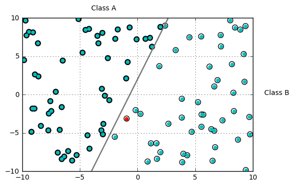

**Assignment #1 for ICS 635**

See  for current version of the simple Perceptron 

Working Example:

Failing Example:

- - -

Notes from class:

1. Implement perceptron learning algorithm: N inputs **xi** and labels li
   * Initialize weight vector **w**
   * While there exist misclassified examples: ⋅⋅

      * Compute yi = θ(**wxi**)      
 
      * For each example, update the weights: **w** += c(li-yi)**xi**
   
1. Play around with the parameter (learning rate) and the input data, and verify for yourself what the Perceptron can and cannot do.

   * Make a movie of Perceptron converging, and one of Perceptron failing on the XOR.
 
1. What else do you notice?

   * Is every solution the same? If not, are some "better" than others in some sense?

- - -

Pseudo Code for perceptron (as I understand):

1. Provide the perceptron with inputs for which there is a known answer
1. Ask the perceptron to guess an answer
1. Compute the error.
    
    * Error = Answer - Guess

1. Adjust all the weights according to the error.

    * Delta Weight = (Error * input) * learning_rate
    * New Weight = weight  + Delta Weight
    
1. Return to step 1 and repeat.
